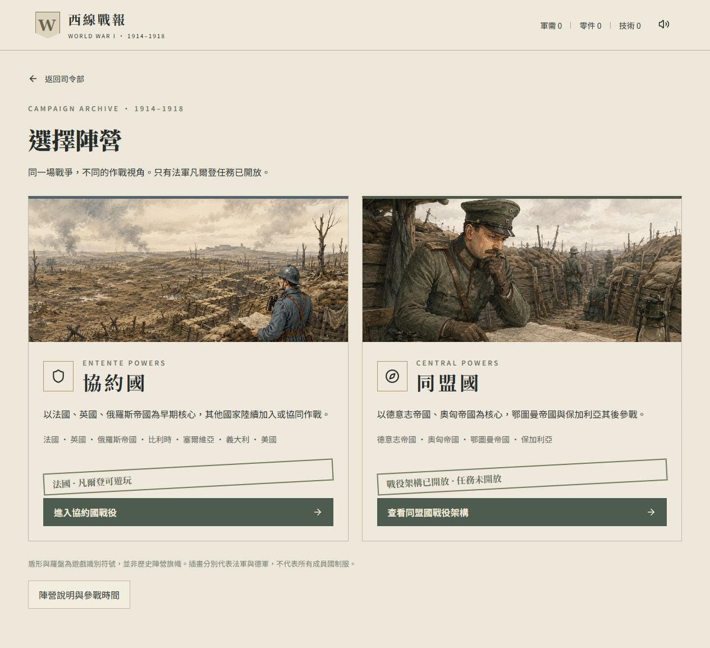
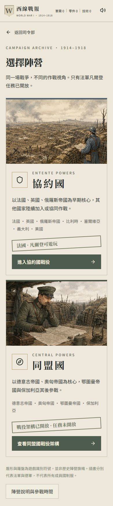
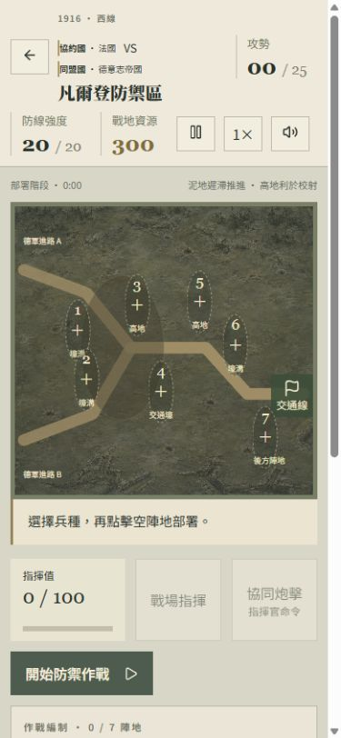

# WWI FACTION FOUNDATION STATUS

2026-09-06 · Scope: WWI Phase 2 faction foundation only. No new full battle.

## Implementation

- Canonical IDs: `ENTENTE` / `CENTRAL_POWERS`; visible names 協約國 / 同盟國. `CENTRAL` remains only as an original v8 migration input. Active WWI files contain no ambiguous 盟軍 label.
- `lib/wwi/campaign.ts`: two FactionData entries; eleven NationData entries with alliance status, entry/exit dates, political transition, annual activity, historical references, independent game availability and visual ownership.
- History and gameplay are separate: 15 neutral HistoricalBattleData records underpin 22 BattleScenarioData perspectives (12 Entente, 10 Central). Verdun's two sides share `VERDUN_1916`; only `VERDUN_1916_FRANCE_DEFENSE` is executable.
- Faction → year → theatre/nation filters → mission. Every faction/year combination is browsable. Locked mission cards expose historical descriptions but no launch, settlement, reward or French fallback.
- MissionHeader is reused on mission cards, briefing, battle HUD and results, with both factions/nations and VS. Commander specialization is universal; its illustration/ownership follows selected nation. Other nations without commissioned art explicitly show unavailable artwork.
- Four nation-neutral UnitArchetypeData mechanics feed the engine. Forty-four NationUnitVariantData records reserve country-specific assets and availability; only four French player variants are implemented. Other variants have null artwork/audio and cannot deploy. Existing German enemy formations remain German, not French player reskins.
- Four universal doctrines and fifteen universal MVP orders remain unchanged in balance. Order availability supports future faction/nation restrictions.
- Save navigation includes selectedFaction, selectedYear, selectedNation, selectedTheatre, selectedScenario. Per-faction campaign progression remains distinct. Original v8 key/version are preserved. Migration maps legacy French clears and records, preserves currencies/training/settings/receipts, never invents Central progress. Navigation survives reload; the app intentionally returns to headquarters rather than resuming an in-progress battle.

## Historical timeline and interpretation

| Nation | Entry | Military end cutoff | Notes |
| --- | --- | --- | --- |
| France | 1914-08-03 | 1918-11-11 | Only implemented campaign |
| United Kingdom | 1914-08-04 | 1918-11-11 | Dominion detail deferred |
| Russian Empire | 1914-08-01 | 1917-12-15 | Empire identity ends 1917-03-15; later Russian history explained, no imperial missions after that date |
| Belgium | 1914-08-04 | 1918-11-11 | Invasion; campaign grouping is not treaty membership |
| Serbia | 1914-07-28 | 1918-11-11 | Occupation is not withdrawal |
| Italy | 1915-05-23 | 1918-11-04 | Neutral in 1914; entry against Austria-Hungary, war with Germany later |
| United States | 1917-04-06 | 1918-11-11 | Associated Power, not ordinary Entente treaty member |
| German Empire | 1914-08-01 | 1918-11-11 | Political collapse distinguished in text |
| Austria-Hungary | 1914-07-28 | 1918-11-04 | Armistice signed Nov 3, effective Nov 4 |
| Ottoman Empire | 1914-10-29 | 1918-10-31 | Black Sea attack; armistice signed Oct 30, effective next day |
| Bulgaria | 1915-10-14 | 1918-09-30 | Armistice signed Sep 29, effective next day |

Dates use ISO day-level cutoffs, not hour-level simulation or formal peace treaty dates. Annual activity means overlap with part of a year; actual scenarios validate exact dates. Russia's political cutoff is separate from later Russian armistice. Gallipoli uses the land campaign Apr 25–Jan 9, not the earlier naval operation. Gorlice scope ends with Lemberg June 22, not the entire Great Retreat. Caporetto uses the National Army Museum's Oct 24–Nov 10 range. Cross-year campaigns are indexed by starting year.

Primary institutional/academic references checked during implementation:

- [National Army Museum timeline](https://ww1.nam.ac.uk/timeline/)
- [National Army Museum Gallipoli](https://www.nam.ac.uk/explore/gallipoli)
- [National Army Museum Somme](https://www.nam.ac.uk/explore/battle-somme)
- [US Office of the Historian: associated participation](https://history.state.gov/departmenthistory/short-history/war)
- [US declaration, April 6 1917](https://history.state.gov/historicaldocuments/frus1917Supp01v01/d240)
- [1914–1918 Online: Brest-Litovsk](https://encyclopedia.1914-1918-online.net/article/brest-litovsk-treaty-of/)
- [1914–1918 Online: Central Powers collapse](https://encyclopedia.1914-1918-online.net/article/the-military-collapse-of-the-central-powers/)
- [Verdun Memorial](https://memorial-verdun.fr/en/ressources/la-bataille-de-verdun)

Further research before implementing another battle: detailed orders of battle, nation-specific weapon/helmet introduction dates, imperial/Dominion formations, scenario-specific start times and opposing contingents. Country art/flags are intentionally not fabricated: flagAsset/emblemAsset remain nullable; shield/compass UI marks explicitly say they are game symbols, not historical flags.

## Planned nodes

Entente: Marne 1914, Ypres 1914, Gallipoli 1915, Ypres 1915, Verdun 1916 (French playable), Somme 1916, Arras 1917, Passchendaele 1917, Cambrai 1917, Spring Offensive defence 1918, Marne 1918, Hundred Days 1918.

Central Powers: Tannenberg 1914, Marne 1914, Gorlice–Tarnów 1915, Gallipoli 1915, Verdun 1916, Somme 1916, Caporetto 1917, Michael 1918, Marne 1918, late-war defence 1918. All locked by design.

## Verification

- TypeScript: PASS.
- `pnpm test:wwi`: PASS. Ten faction regression groups, eight targeted regression groups, original economic/engine checks, and 27/27 successful 20-wave balance simulations. Mean duration 12.982 minutes, mean purchase interval 31.836 seconds. Idle/no-cost strategy still fails as intended.
- Scoped `oxlint lib/wwi components/wwi tests/wwi-factions.ts tests/wwi.ts`: PASS. Static image use has a documented rule exception because GitHub Pages has no image-optimization server.
- `pnpm build`: PASS on Windows. Linux GitHub Actions additionally runs the test suite and static Pages build before deployment.
- Full repository lint: NOT CLEAN due to pre-existing unused imports, accessibility and typing errors in dormant fantasy/shared UI files; these were not silently changed or represented as fixed.
- Browser: all ten faction/year combinations checked. Central cards = 2/2/2/1/3 and zero launches; Entente cards = 2/2/2/3/3, with one launch only in 1916. Belgium 1916 empty filter does not jump to France. Reload retains Central ownership and selected 1918 year. French briefing, deployment, initial combat, pause and exit checked. No browser console errors during the tested local flow.
- Responsive: default desktop and 390px viewport checked; faction images loaded, no horizontal overflow. Battle HUD remains readable at mobile width.

## Completion gate

PASS: 協約國 terminology; 同盟國 terminology; ambiguous 盟軍 removal in active WWI UI; FactionData; NationData; alliance status; entry/exit dates; Italy 1915; USA 1917; Russia withdrawal/transition; HistoricalBattleData; BattleScenarioData; Verdun faction header; Entente navigation; Central navigation; locked behavior; historical/game availability separation; faction UI; Japanese historical WWI faction artwork; navigation save; regressions; build.

Artwork skill influenced the new neutral German faction illustration; existing French art was reused. Prompts, generation mode and final asset path are in `wwi-art-prompts.md`. No next full battle has been started.

## Screenshots

